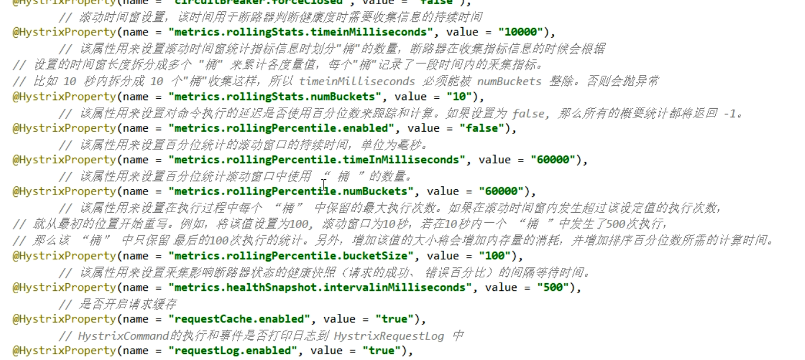
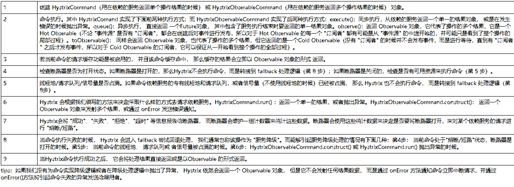
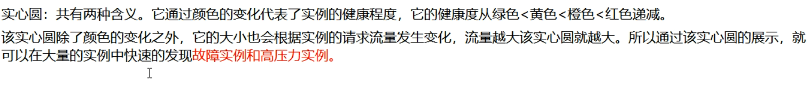
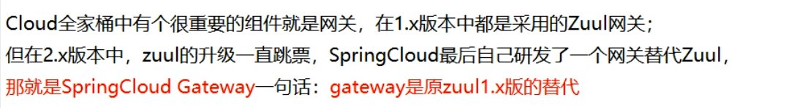
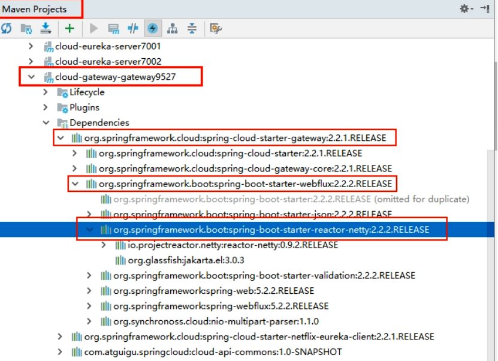
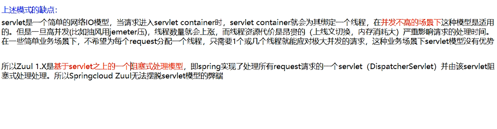

# Spring Cloud 

---

## 一、微服务架构理论入门

- [推荐入门参照](http://c.biancheng.net/spring_cloud/)


- SpringBoot2.X版和SpringCloud H版

### （1）版本选择

|       技术类型       |    选择的版本     |
| :------------------: | :---------------: |
|     Spring Cloud     |  **Hoxton.SR3**   |
|     Spring Boot      | **2.2.5.RELEASE** |
| Spring Cloud Alibaba | **2.2.0.RELEASE** |
|         java         |       JAVA8       |
|        maven         |     3.5及以上     |
|        mysql         |     5.7及以上     |

### （2）组件停更/升级/替换

#### 1. 停更不停用

- 被动修复bugs
- 不再接受合并请求
- 不再发布新版本
- 听课不停学

#### 2. 组件版本


#### 3. 版本升级


### （3）官网资料

- [Spring Cloud官网](https://cloud.spring.io/spring-cloud-static/Hoxton.SR3/reference/html/spring-cloud.html)
- [Spring Cloud 中文文档](https://www.bookstack.cn/read/spring-cloud-docs/docs-project-SpringCloudConfig.md)
- [Spring Boot 官网](https://docs.spring.io/spring-boot/docs/2.2.5.RELEASE/reference/html/)

### （4）Eureka服务注册与发现

- 云端服务发现，一个基于 REST 的服务，用于定位服务，以实现云端中间层服务发现和故障转移。

#### 1. Eureka基础知识

- 什么是服务治理？

  ​

- 什么是服务注册?

  ​


- Eureka两组件C/S

  ​

#### 2. 单机Eureka构建步骤

- 建module
- 改pom文件
- 写yml配置文件
- 主启动
- 业务类

## 二、微服务架构组件

- 约定 > 配置 > 编码

> 1. 什么是服务注册与发现？

服务注册/发现是微服务架构中不可或缺的重要组件，起初服务都是单节点的甚至是单体服务，不保障高可用性，也不考虑服务的压力承载，服务之间调用单纯的通过接口访问（HttpClient/RestTemplate），直到后面出现了多个节点的分布式架构，起初的解决手段是在服务端负载均衡，同时在网关层收束接口，使不同的请求转发到对应不同端口上，这也是前后分离防止前端跨域的手段之一：


**缺点：** nginx并不具有服务健康检查的功能，服务调用方在调用一个服务之前是无法知悉服务是否可用的，不考虑这一点分布式的架构高可用的目标就成了一个摆设，解决手段也很简单：对超时或是状态码异常的请求进行重试尝试，请求会被分发到其他可用节点，或者采用服务注册与发现机制察觉健康的服务。

> 2. 服务注册与发现技术选型

注册中心的解决方案很多，zookeeper、Eureka(当时时Eureka2.0已经闭源，不再更新，因此不建议后续项目使用此组件)、etcd、以及consul等。


- Eureka是很优秀的服务注册组件，但是Netflix将2.0闭源后，便已不是最优选择，不过现有的项目使用Eureka 1.x功能已足够使用，不必急于更换技术栈。
- zookeeper是一个很强大的k-v组件，功能应是这些技术中最多的，但是我们只需要服务注册的组件，paxos的一致性算法也不如raft高效，保持长连接会对服务造成一定的影响。
- etcd其实只是一个k-v系统，需要额外添加对服务发现的支持。

### （1）Eureka 注册中心

#### 1. Eureka  自我保护

- 故障现象
- 导致原因
- 怎么禁止自我保护

#### 2. Eureka 停更说明

- [参见Netflix官网](https://github.com/Netflix/eureka/wiki)

  ```txt
  有关eureka 2.0的现有开源工作已停止。在2.x分支上作为现有工作资料库的一部分发布的代码库和工件被视为使用后果自负。

  Eureka 1.x是Netflix服务发现系统的核心部分，仍然是一个活跃的项目。
  ```


### （2）Zookeeper注册中心

- zookeeper是一个分布式协调工具，可以实现注册中心功能
- zookeeper服务器取代Eureka服务器，zk作为服务注册中心

#### 1. zookeeper默认端口号

- 代码访问client的端口号： 2181
- leader和flower通信的端口号： 2888
	 选举leader时通信的端口号：	3888	
- 其他服务与监控中心通信端口： 7070

#### 2. zoo.cfg配置文件详解


- zookeeper常用命令

```java
./zkServer.sh start 		//启动zookeeper服务端
./zkServer.sh status 		//查看zookeeper状态（model显示状态）	
./zkCli.sh 					//启动zookeeper客户端
quit 						//退出客户端
./zkServer.sh stop			//退出zookeeper服务端
客户端
help   						//显示所有操作指令
ls /						//查看当前znode中所包含的内容
ls2 /						//查看当前节点的详细数据
create /sanguo 				//在此client下创建名称为sanguo的节点  
								后面可指定节点内容  例子：create /sanguo "liubei"
create /sanguo/shuguo "liubei" //创建多级目录
get /sanguo/shuguo			//获取创建节点内的内容
get -w /sanguo/shuguo		//获得节点内容，并且设置监听（设置一次监听一次）(当此节点下内容变化有输出)			
create -e /sanguo/weiguo "caocao"	//-e创建短暂的节点(client重启后节点消失)	
create -s /sanguo/weiguo "caocao"	//-s创建带有序号的节点（序号从总共节点数开始往后排）
set /sanguo/shuguo "diaochan"		//修改节点内的值zhouyu->diaochan
ls -w /sanguo						//监听子节点的变化
delete /sanguo/wuguo2				//删除/sanguo下的wuguo2
deleteall /sanguo/wuguo				//递归删除
```

### （3）Consul 注册中心

#### 1. Consul 简介   

- Consul是基于GO语言开发的开源工具，主要面向分布式，服务化的系统提供服务注册、服务发现和配置管理的功能。Consul的功能都很实用，其中包括：服务注册/发现、健康检查、Key/Value存储、多数据中心和分布式一致性保证等特性。Consul本身只是一个二进制的可执行文件，所以安装和部署都非常简单。
- **优点：** 
  - 基于raft协议，比较简洁，支持健康检查
  - 支持HTTP和DNS协议 ，支持夸数据中心的WAN集群，提供图形界面
  - 跨平台，支持Linux、Windows、Mac.

#### 2. Consul 特性

- **服务注册与发现：** 客户端通过Consul提供服务,其他客户端可以使用Consul发现服务的提供者。使用类似DNS或者HTTP的方式发现。

  注意：为什么微服务架构下就需要做服务注册和服务发现呢？

  微服务的目标就是要将原来大一统的系统架构，拆分成细粒度的按功能职责分成的小系统，这样就会出现很多小的系统，部署的节点也会随之增加。试想一下，如果没有一个统一的服务组件来管理各系统间的列表，微服务架构是很难落地实现的。

  **Consul提供的服务注册/发现功能在数据强一致性和分区容错性上都有非常好的保证，但在集群可用性下就会稍微差一些（相比Euerka来说）**  

-  **健康监测：** 支持多种协议，HTTP、TCP、Docker、Shell脚本定制化 监测，Consul可以快速提醒操作员有关群集中的任何问题。与服务发现的集成可防止将流量路由到不正常的主机，并启用服务级别的断路器。

- **Key/Value存储：** Consul支持Key/Value存储功能，可以将Consul作为配置中心使用，可以将一些公共配置信息配置到Consul，然后通过Consul提供的 HTTP API来获取对应Key的Value。

- **多数据中心：**支持多数据中心(Data Center),多个数据中心之间通过Gossip协议进行数据同步。多数据中心的好处是当某个数据中心出现故障时，其他数据中心可以继续提供服务，提升了可用性。

- **可视化Web界面**

#### 3. Consul 的安装

- [Consul官网下载链接](https://www.consul.io/downloads.html)

- 使用方式

  - [windows版本](https://www.cnblogs.com/aixinge/p/9118337.html)：环境变量可以不配置直接在对应的目录打开即可使用  

- 常用命令

  - 查看版本号： `consul --version`


  - cmd 命令窗口执行启动consul：`consul agent -dev` 

  - consul 自带 UI 界面，打开网址：[http://localhost:8500](https://link.zhihu.com/?target=http%3A//localhost%3A8500/) ，可以看到当前注册的服务界面

  - cmd 命令窗口执行: 

    `consul.exe agent -server ui -bootstrap -client 0.0.0.0 -data-dir="E:\consul" -bind X.X.X.X` 

    其中X.X.X.X为服务器ip,即可使用http://X.X.X.X:8500 访问ui而不是只能使用localhost连接

- 基本命令：

```html
1、consul启动
# consul agent -dev # -dev表示开发模式运行，另外还有-server表示服务模式运行

注意：-dev节点的启动不能用于生产环境，因为该模式下不会持久化任何状态，该启动模式仅仅是为了快速便捷的启动单节点consul。

2、查看consul cluster中consul节点的信息
# consul members

说明：
Address：节点地址
Status：alive表示节点健康
Type：server运行状态是server状态
DC：dc1表示该节点属于DataCenter1

注意：members命令的输出是基于gossip协议的，并且是最终一致的，也就是说某一个时刻你去运用该命令查到的consul节点的状态信息可能是有误的。

输入 http://127.0.0.1:8500/ui/ 访问Consul。

3、停止服务（优雅退出）
# CTRL+C
该节点离开后，会通知cluster中的其他节点
```

#### 4. Consul的使用

- [Springcloud consul的官网](https://www.springcloud.cc/spring-cloud-consul.html)

### （4）注册中心选型


#### 1. CAP理论知识

[CAP理论](https://www.cnblogs.com/mingorun/p/11025538.html)作为分布式系统的基础理论,它描述的是一个分布式系统在以下三个特性中：

- 一致性（**C**onsistency）

- 可用性（**A**vailability）

- 分区容错性（**P**artition tolerance）

  

最多满足其中的两个特性。也就是下图所描述的。分布式系统要么满足CA,要么CP，要么AP。无法同时满足CAP。

**CAP理论关注粒度是数据，而不是整体系统设计的策略**


#### 2. AP(Eureka)


#### 3. CP(Zookeeper/Consul)


### （5）Ribbon 负载均衡

- 负载均衡服务调用

#### 1. Ribbon简介

**Spring Cloud Ribbon**是基的于Netflix Ribbon实现一个基于HTTP和TCP的客户端负载均衡工具。通过Spring Cloud的封装，可以让我们轻松地将面向服务的REST模板请求自动转换成客户端负载均衡的服务调用。

- 主要功能

Ribbon 提供客户端的软件负载均衡算法和服务调用。

#### 2. 负载均衡理论知识


- **集中式LB**

  即在服务的消费方和提供方之间使用独立的LB设施，（可以是硬件：F5,可以是软件：nginx）由该设施负责把访问请求通过某种策略转发至服务器的提供方。

- **进程内LB**

  将LB逻辑集成到消费方，消费方从服务注册中心获知有哪些地址可以用，然后自己再从这些地址中选出合适的服务器。

  **Ribbon就属于进程内的LB**,它只是一个类库，集成于消费方进程，消费方通过它来获取到服务提供方的地址。

> **负载均衡+RestTemplate调用**

#### 3. 负载均衡架构


- Ribbon在工作中分为两步：

  1. 选择EurekaServer,优先选择在同一个区域内负载较少的server
  2. 再根据用户指定的策略，在从server取到的服务注册列表中选择一个地址。其中Ribbon提供了多种策略，比如：轮询、随机、根据响应时间加权。

  

**Ribbon其实就是一个软负载均衡的客户端组件，他可以和其他所需请求的客户端结合使用，和eureka结合只是其中的一个实例。**

#### 4. RestTemplate的使用

- [RestTemplate官网](https://docs.spring.io/spring-framework/docs/5.2.2.RELEASE/javadoc-api/org/springframework/web/client/RestTemplate.html)
- [使用方法](https://www.cnblogs.com/f-anything/p/10084215.html)
- [SpringBoot2.2.5 版本去除默认的RestTemplate的bean，需要自定义](https://blog.csdn.net/qq_41893274/article/details/105064993)


> （1）服务调用方式

- RPC：Remote Produce Call远程过程调用，类似的还有RMI。自定义数据格式，基于原生TCP通信，速度快，效率高。早期的webservice，现在热门的dubbo，都是RPC的典型代表
- Http：http其实是一种网络传输协议，基于TCP，规定了数据传输的格式。现在客户端浏览器与服务端通信基本都是采用Http协议，也可以用来进行远程服务调用。缺点是消息封装臃肿，优势是对服务的提供和调用方没有任何技术限定，自由灵活，更符合微服务理念。

> （2）[POST和Get的区别](https://blog.csdn.net/qq_38182125/article/details/89071899?depth_1-utm_source=distribute.pc_relevant.none-task&utm_source=distribute.pc_relevant.none-task)

- Get是不安全的，因为在传输过程，数据被放在请求的URL中；Post的所有操作对用户来说都是不可见的。
- Get传送的数据量较小，这主要是因为受URL长度限制；Post传送的数据量较大，一般被默认为不受限制。
- Get限制Form表单的数据集的值必须为ASCII字符；而Post支持整个ISO10646字符集。
- Get执行效率却比Post方法好。Get是form提交的默认方法。

|     请求方式     |                GET                 |               POST               |
| :--------------: | :--------------------------------: | :------------------------------: |
|     参数位置     |            url的query中            |    一般在content中，query也可    |
|     参数大小     | 受限于浏览器url大小，一般不超过32K |                1G                |
|  服务器数据接收  |              接收1次               |    根据数据大小，可分多次接收    |
| 适用场景（语义） |   从服务器端获取数据，不做增删改   | 向服务器提交数据，如做增删改操作 |
|      安全性      |     参数携带在url中，安全性低      |    相对于GET请求，安全性更高     |

- GET请求中URL的最大长度限制总结
- 浏览器

```java
1、IE
IE浏览器（Microsoft Internet Explorer） 对url长度限制是2083（2K+53），超过这个限制，则自动截断（若是form提交则提交按钮不起作用）。

2、firefox
firefox（火狐浏览器）的url长度限制为 65 536字符，但实际上有效的URL最大长度不少于100,000个字符。

3、chrome
chrome（谷歌）的url长度限制超过8182个字符返回本文开头时列出的错误。

4、Safari
Safari的url长度限制至少为 80 000 字符。

5、Opera
Opera 浏览器的url长度限制为190 000 字符。Opera 9 地址栏中输入190 000字符时依然能正常编辑。
```

- 服务器

```java
1、apache
apache能接受url长度限制为8 192 字符

2、IIS
Microsoft Internet Information Server(IIS)能接受url长度限制为16 384个字符。
这个是可以通过修改的（IIS7）configuration/system.webServer/security/requestFiltering/requestLimits@maxQueryString setting.<requestLimits maxQueryString="length" />

3、Perl HTTP::Daemon
Perl HTTP::Daemon 至少可以接受url长度限制为8000字符。Perl HTTP::Daemon中限制HTTP request headers的总长度不超过16 384字节(不包括post,file uploads等)。但当url超过8000字符时会返回413错误。
这个限制可以被修改，在Daemon.pm查找16×1024并更改成更大的值。

4、ngnix
可以通过修改配置来改变url请求串的url长度限制。

client_header_buffer_size 默认值：client_header_buffer_size 1k

large_client_header_buffers 默认值 ：large_client_header_buffers 4 4k/8k
```

#### 5. Ribbon负载规则

> **IRule:根据特定算法从服务列表中选取一个要访问的服务**


1. RoundRobinRule: 轮询

2. RandomRule ：随机

3. RetryRule： 先按照RoundRobinRule的策略获取服务，如果获取服务失败则在指定时间内会进行重试

4. WeightedResponseTimeRule ：

   对RoundRobinRule的扩展，响应速度越快的实例选择权重越大，越容易被选择

5. BestAvailableRule ：

   会先过滤掉由于多次访问故障而处于断路器跳闸状态的服务，然后选择一个并发量最小的服务

6. AvailabilityFilteringRule ：先过滤掉故障实例，再选择并发较小的实例

7. ZoneAvoidanceRule ：默认规则，复合判断server所在区域的性能和server的可用性选择服务器

> **如何替换Ribbon的默认规则**


> **Ribbon 负载均衡算法**

- 原理


### （6）OpenFeign服务调用

#### 1. OpenFeign简介

> what?  [官网](https://cloud.spring.io/spring-cloud-static/spring-cloud-openfeign/2.2.2.RELEASE/reference/html/)

​      Feign是一种声明式、模板化的HTTP客户端。在Spring Cloud中使用Feign，可以做到使用HTTP请求访问远程服务，就像调用本地方法一样的，开发者完全感知不到这是在调用远程方法，更感知不到在访问HTTP请求。

> Why


> **Feign和OpenFeign两者区别**


#### 2. Open调用关系总结


> **1. openfeign超时控制**

- OpenFeign默认等待一秒钟，超过后报错

  

默认Feign客户端只等待一秒钟，但是服务端处理需要超过一秒，导致Feign客户端不想等待了，直接报错，为了避免这种情况，有时候我们需要设置Feign客户端的超时控制。（yml文件开启超时控制）

- YML文件里需要开启OpenFeign客户端超时控制

```yml
ribbon:
  ReadTimeout:  5000
  ConnectTimeout: 5000
```

> **2. OpenFeign日志打印功能**

- Feign 提供了日志打印功能，我们可以通过配置来调整日志打印功能，从而了解Feign中Http请求的细节，简言之就是对Feign接口调用情况进行监控和输出。
- Feign日志级别
  1. `NONE`，不记录（**DEFAULT**）。
  2. `BASIC`，仅记录请求方法和URL以及响应状态代码和执行时间。
  3. `HEADERS`，记录基本信息以及请求和响应标头。
  4. `FULL`，记录请求和响应的标题，正文和元数据。

### （7）Hystrix断路器

- 分布式系统面临的问题

  

- 服务雪崩

  

> 通常当你发现一个模块下的某个实例失败后，这时这个模块依然还会接受流量然后这个有问题的模块还调用了其他的模块，这样就发生了级联故障，或者叫雪崩。

#### 1. Hystrix断路器 概述


- 主要功能
  1. 服务降级
  2. 服务熔断
  3. 接近实时的监控

[官网资料](https://github.com/Netflix/Hystrix/wiki/How-To-Use)

> **一、Hystrix官宣，停更进维**

- [验证地址](https://github.com/Netflix/Hystrix)

  ```java
  Hystrix Status
  Hystrix is no longer in active development, and is currently in maintenance mode.
  ```

- 接下来怎么办

  - 被动修复bugs
  - 不再接受合并请求
  - 不再发布新版本

#### 2. Hystrix重要概念

- [参考原文](https://www.jianshu.com/p/33f394c0ee2d)

> 1. **服务降级**

- 系统将某些不重要的业务或接口的功能降低，可以只提供部分功能，也可以完全停到所有所有不重要的功能。降级的思想是丢车保帅。

- 哪些情况会触发降级
  1. 程序运行异常
  2. 超时
  3. 服务熔断触发服务降级
  4. 线程池/信号量打满也会导致服务降级

- 常见的降级方式

  - 系统后门降级：系统预留后门用于降级，比如提供一个降级URL，访问URL时就执行降级指令。缺点：如果服务器数量多，需要一台一台去操作，效率低。
  - 独立系统降级：将降级操作独立到一个单独的系统中，可以实现复杂的权限管理、批量操作等功能。

  

> 2. **服务熔断**

- 降级是应对系统自身的故障，而熔断的目的是应对外部系统的故障。比如A服务的X功能依赖B服务的某个接口，当B服务接口响应很慢时，A服务X功能的响应也会被拖慢，进一步导致了A服务的线程都卡在了X功能上，A服务的其它功能也会卡主或拖慢。此时就需要熔断机制，即A服务不在请求B这个接口，A服务内部发现B接口就直接返回错误，从而避免整个A服务被拖慢。 
- 服务的降级->进而熔断->恢复调用链路 
- 实现思路：需要系统有一个统一的API调用层，由API来进行采样或者统计。

> 3. **服务限流**

- 只允许系统能够承受的访问量进来，超出的会被丢弃。
- **降级**从系统功能优先级角度考虑如何应对故障，而**限流**则从用户访问压力的角度来考虑如何应对故障。


- 秒杀高并发等操作，严禁一窝蜂的过来拥挤，大家排队，一秒钟N个，有序进行
- 常见的限流方式：
  - 基于请求限流：指从外部请求的角度考虑限流。常见的方式有：
    1. 限制总量：限制某个指标的累积上限。比如直播间的用户总数上限为100万，超过后用户无法进入。抢购商品数量为100，限制抢购用户上限为1万个，超过或直接拒绝。
    2. 限制时间量：限制一段时间内某个指标的上限。例如：一分钟内只允许1000个用户访问。每秒请求峰值为10万。
    3. 都需要找到合适的阀值：需要通过性能压测来确定阀值或者逐步优化。
  - 基于资源限流：指从系统内部考虑，找到影响性能的关键资源，对其使用上限限制。常见的内部资源有：连接数、文件句柄、线程数、请求队列、CPU利用率等。例如，使用Netty实现服务器，每个请求先放到请求队列中，业务线程从请求队列中获取任务进行处理，请求队列大小为1000，那么超过该值则直接拒绝。 

**正因为有上述故障或不佳表现，才有我们的降级/容错/限流等技术诞生**

> 4. **如何解决？解决的要求**

- 超时导致服务器变慢（转圈）——超时不再等待
- 出错（宕机或程序运行出错）——出错要兜底
- 解决：
  - 对方服务（8001）超时了，调用者（80）不能一直卡死等待，必须有服务降级
  - 对方服务（8001）down机了，调用者（80）不能一直卡死等待，必须有服务降级
  - 对方服务（8001）OK，调用者（80）自己出故障或有自我要求（自己的等待时间小于服务提供者），自己处理降级

#### 3. 服务熔断原理

> 服务降级

- 降低配置   `@HystrixCommand`

- 8001先从自身找问题

  设置自身调用超时时间的峰值，峰值内可以正常运行，超过了需要有兜底的方法处理，作服务降级fallback

- 8001fallback

  - 业务类启用  ` @HystrixCommand报异常后如何处理`

    

    **一旦调用服务方法失败并抛出了错误信息后，会自动调用@HystrixCommand标注好的fallbackMethod调用类中的指定方法**

  - 主启动类激活  ` 添加新注解@EnableCircuitBreaker`

> 服务熔断

- 断路器：一句话就是家里保险丝

- 熔断

  

  大神论文：[原文](https://martinfowler.com/bliki/CircuitBreaker.html)

- [Hystrix原理总结](https://blog.csdn.net/wudiyong22/article/details/78690473)

  

- 断路器执行流程

  1. 断路器在什么情况下开始起作用？

     

  2. 断路器开启或者关闭的条件

     - 当满足一定阀值的时候（默认10秒内超过20个请求次数）
     - 当失败率达到一定的时候（默认10秒内超过50%请求失败）
     - 到达以上阀值，断路器将会开启
     - 当开启的时候，所有请求都不会进行转发
     - 一段时间之后（默认是5秒），这个时候断路器是半开状态，会让其中一个请求进行转发。如果成功，断路器会关闭，若失败，继续开启。重复4和5

  3. 断路器打开之后

     

  4. All配置

     

     

     

     

> 服务限流

- 后面和alibaba的Sentinel对比说明

#### 4. hystrix工作流程

- [官网原文](https://github.com/Netflix/Hystrix/wiki/How-it-Works)

- [工作流程](https://www.cnblogs.com/yawen/p/6655352.html)

  - 官网图例

    

  - 步骤说明

  

  `流程说明:`

  `1:每次调用创建一个新的HystrixCommand，把依赖调用封装在run()方法中。`

  `2:执行execute()/queue做同步或异步调用。`

  `3:判断熔断器(circuit-breaker)是否打开，如果打开跳到步骤8，进行降级策略，如果关闭进入步骤。`

  `4:判断线程池/队列/信号量是否跑满，如果跑满进入降级步骤8，否则继续后续步骤。`

  `5:调用HystrixCommand的run方法。运行依赖逻辑`

  `5a:依赖逻辑调用超时，进入步骤8。`

  `6`:判断逻辑是否调用成功`

  `6a:返回成功调用结果`

  `6b:调用出错，进入步骤8。`

  `7:计算熔断器状态，所有的运行状态(成功, 失败, 拒绝,超时)上报给熔断器，用于统计从而判断熔断器状态。`

  `8:getFallback()降级逻辑。`

  `  以下四种情况将触发getFallback调用：`

  ` (1)：run()方法抛出非HystrixBadRequestException异常`

  ` (2)：run()方法调用超时`

  ` (3)：熔断器开启拦截调用`

  ` (4)：线程池/队列/信号量是否跑满`

  `8a:没有实现getFallback的Command将直接抛出异常`

  `8b:fallback降级逻辑调用成功直接返回`

  `8c:降级逻辑调用失败抛出异常`

  `9:返回执行成功结果`

#### 5. 服务监控Dashboard

> 概述


> 启动URL：`http://localhost:9001/hystrix`

**DashBoard如何看？**


- 7色

- 1圈

  

- 1线

  曲线：用来记录两分钟内记录流量的对比变化，可以通过它来观察到流量的上升和下降趋势

- 图示1

  

- 图示2

  

## 三、Alibaba 系列组件

### （1）Gateway新一代网关

- [上一代zuul 1.X](https://github.com/Netflix/zuul/wiki)
- [Spring Cloud Gateway](https://cloud.spring.io/spring-cloud-gateway/2.2.x/reference/html/)

#### 1. Gateway简介




> 概述


- [官网原文](https://cloud.spring.io/spring-cloud-gateway/2.2.x/reference/html/)

**Spring Cloud Gateway 使用的Webflux中的reactor-netty响应式编程组件，底层使用了Netty通讯框架**

- 源码作证



#### 2. Gateway主要功能

- 反向代理
- 鉴权
- 流量控制
- 熔断
- 日志监控

> 微服务架构网关设计


#### 3. zull替代gateway的由来

> 1. **我们为什么选择Gatway?**

- neflix不太靠谱，zuul2.0一直跳票,迟迟不发布

  

- SpringCloud Gateway具有如下特性


- SpringCloud Gateway与Zuul的区别


> 2. **Zuul1.x模型**




> 3. **GateWay模型**】

- [Spring Framework 5常见问题解答](https://github.com/spring-projects/spring-framework/wiki/Spring-Framework-5-FAQ)


- WebFlux是什么？

  - [Spring官网原文](https://docs.spring.io/spring/docs/current/spring-framework-reference/web-reactive.html)
  - [Spring WebFlux 教程](https://www.xttblog.com/spring-webflux.html)

  ​      WebFlux 是 Spring 官方推出来的一个新框架，目前百度百科上还没有对应的词条。

  ​           在没有 WebFlux 之前，也就是传统的命令式编程模式，程序都是按照人工编写的指令（一般情况下，不考虑重排序）一步一步执行下去，下一步的执行需要等待之前的命令完成，也就是说，这条线程一直是在阻塞、执行中交替进行。无论怎么进行优化代码，提升性能，但是本质上还是需要依赖上一个任务的完成。

  所以 WebFlux 应用而生，响应式编程千呼万唤终于来临，会对现有的编程模式和思想形成巨大的冲击。WebFlux 将会成为未来的主流！

  

  


#### 4. 三大核心概念

> Route(路由)

路由是构建网关的基本模块，它由ID，目标URI，一系列的断言和过滤器组成，如果断言为true则匹配该路由

> Predicate（断言）

参考的是java8的java.util.function.Predicate开发人员可以匹配HTTP请求中的所有内容（例如请求头或请求参数），如果请求与断言相匹配则进行路由

> Filter(过滤)

指的是Spring框架中GatewayFilter的实例，使用过滤器，可以在请求被路由前或者之后对请求进行修改。

- 总结：


#### 5. Gateway工作流程

- 路由转发+执行过滤器链


#### 6. 入门配置

- **gateway网关不需要引入web相关的包否则报错**
- 配置方式
  - 在配置文件yml中配置
  - 代码中注入RouteLocator的Bean

> **1. 通过微服务名实现动态路由**

默认情况下Gateway会根据注册中心的服务列表，以注册中心上微服务名为路径创建动态路由进行转发，从而实现动态路由的功能

#### 7. Predicate的使用

- 每一个`Predicate`的使用，你可以理解为：`当满足这种条件后才会被转发`，如果是多个，那就是都满足的情况下被转发。
- [使用参考](https://www.cnblogs.com/snail90/p/11719573.html)
- [官网原文](https://cloud.spring.io/spring-cloud-gateway/reference/html/#gateway-request-predicates-factories)


- Predicate就是为了实现一组匹配规则，让请求过来找到对应的Route进行处理

#### 8. Filter的使用

- [官网原文](https://cloud.spring.io/spring-cloud-gateway/reference/html/#gatewayfilter-factories)
- [参考文章](https://juejin.im/post/5dad50d5e51d4524a00608a3)


> 1. **自定义全局过滤器**

当请求与路由匹配时，过滤Web处理程序会将的所有实例`GlobalFilter`和所有特定`GatewayFilter`于路由的实例添加到过滤器链中。该组合的过滤器链按`org.springframework.core.Ordered`接口排序，您可以通过实现该`getOrder()`方法进行设置。

由于Spring Cloud Gateway区分过滤器逻辑执行的“前”和“后”阶段（请参见[工作原理](https://cloud.spring.io/spring-cloud-static/spring-cloud-gateway/2.2.2.RELEASE/reference/html/#gateway-how-it-works)），因此优先级最高的过滤器是“前”阶段中的第一个，而“后”阶段中的最后一个相对应。

以下清单配置了一个过滤器链：

例子56. ExampleConfiguration.java

```java
@Bean
public GlobalFilter customFilter() {
    return new CustomGlobalFilter();
}

public class CustomGlobalFilter implements GlobalFilter, Ordered {

    @Override
    public Mono<Void> filter(ServerWebExchange exchange, GatewayFilterChain chain) {
        log.info("custom global filter");
        return chain.filter(exchange);
    }

    @Override
    public int getOrder() {
        return -1;
    }
}
```


#### 9. GateWay 小结

[Spring Cloud](http://c.biancheng.net/spring_cloud/) Gateway 是 [Spring](http://c.biancheng.net/spring/) 官方基于 Spring 5.0、Spring Boot 2.0 和 Project Reactor 等技术开发的网关，Spring Cloud Gateway 旨在为微服务架构提供一种简单有效的、统一的 API 路由管理方式。

Spring Cloud Gateway 作为 Spring Cloud 生态系中的网关，其目标是替代 Netflix Zuul，它不仅提供统一的路由方式，并且基于 Filter 链的方式提供了网关基本的功能，例如：安全、监控/埋点和限流等。

Spring Cloud Gateway 依赖 Spring Boot 和 Spring WebFlux，基于 Netty 运行。它不能在传统的 servlet 容器中工作，也不能构建成 war 包。

在 Spring Cloud Gateway 中有如下几个核心概念需要我们了解：

- #### Route

Route 是网关的基础元素，由 ID、目标 URI、断言、过滤器组成。当请求到达网关时，由 Gateway Handler Mapping 通过断言进行路由匹配（Mapping），当断言为真时，匹配到路由。

- #### Predicate

Predicate 是 [Java](http://c.biancheng.net/java/) 8 中提供的一个函数。输入类型是 Spring Framework ServerWebExchange。它允许开发人员匹配来自 HTTP 的请求，例如请求头或者请求参数。简单来说它就是匹配条件。

- #### Filter

Filter 是 Gateway 中的过滤器，可以在请求发出前后进行一些业务上的处理。

##### （1）Gateway 工作原理

Spring Cloud Gateway 的工作原理跟 Zuul 的差不多，最大的区别就是 Gateway 的 Filter 只有 pre 和 post 两种。下面我们简单了解一下 Gateway 的工作原理图，如图 1 所示。


客户端向 Spring Cloud Gateway 发出请求，如果请求与网关程序定义的路由匹配，则该请求就会被发送到网关 Web 处理程序，此时处理程序运行特定的请求过滤器链。

过滤器之间用虚线分开的原因是过滤器可能会在发送代理请求的前后执行逻辑。所有 pre 过滤器逻辑先执行，然后执行代理请求；代理请求完成后，执行 post 过滤器逻辑。

##### （2）整合Eureka

> 创建 Gateway 项目

创建一个 [Spring](http://c.biancheng.net/spring/) Boot 的 [Maven](http://c.biancheng.net/maven/) 项目，增加 [Spring Cloud](http://c.biancheng.net/spring_cloud/) Gateway 的依赖，代码如下所示。

```java
<parent>
    <groupId>org.springframework.boot</groupId>
    <artifactId>spring-boot-starter-parent</artifactId>
    <version>2.0.6.RELEASE</version>
    <relativePath />
</parent>
<dependencyManagement>
    <dependencies>
        <dependency>
            <groupId>org.springframework.cloud</groupId>
            <artifactId>spring-cloud-dependencies</artifactId>
            <version>Finchley.SR2</version>
            <type>pom</type>
            <scope>import</scope>
        </dependency>
    </dependencies>
</dependencyManagement>
<dependencies>
    <dependency>
        <groupId>org.springframework.cloud</groupId>
        <artifactId>spring-cloud-starter-gateway</artifactId>
    </dependency>
</dependencies>
```

启动类就按 Spring Boot 的方式即可，无须添加额外的注解。代码如下所示。

```java
@SpringBootApplication
public class App {
    public static void main(String[] args) {
        SpringApplication.run(App.class, args);
    }
}
```

> 路由转发示例

下面来实现一个最简单的转发功能——基于 Path 的匹配转发功能。

Gateway 的路由配置对 yml 文件支持比较好，我们在 resources 下建一个 application.yml 的文件，内容如下：

```yml
server:
  port: 2001
spring:
  cloud:
    gateway:
      routes:
        - id: path_route
        uri: http://c.biancheng.net
        predicates:
          - Path=/spring_cloud
```

当你访问 http://localhost:2001/spring_cloud 的时候就会转发到 http://c.biancheng.net/spring_cloud。

- 如果我们要支持多级 Path，配置方式跟 Zuul 中一样，在后面加上两个`*`号即可，比如：

```yml
- id: path_route2
uri: http://c.biancheng.net
predicates:
  - Path=/spring_cloud/**
```

这样一来，上面的配置就可以支持多级 Path，比如访问 http://localhost:2001/spring_cloud/view/1 的时候就会转发到 http://c.biancheng.net/spring_cloud/view/1。

> 整合 Eureka 路由

添加 Eureka Client 的依赖，代码如下所示。

```java
<dependency>
    <groupId>org.springframework.cloud</groupId>
    <artifactId>spring-cloud-starter-netflix-eureka-client</artifactId>
</dependency>
```

配置基于 Eureka 的路由：

```yml
- id: user-service
uri: lb://user-service
predicates:
  - Path=/user-service/**
```

uri 以`lb：//`开头（lb 代表从注册中心获取服务），后面接的就是你需要转发到的服务名称，这个服务名称必须跟 Eureka 中的对应，否则会找不到服务，错误代码如下：

```java
org.springframework.cloud.gateway.support.NotFoundException: Unable to find instance for user-service1
```

>  整合 Eureka 的默认路由

Zuul 默认会为所有服务都进行转发操作，我们只需要在访问路径上指定要访问的服务即可，通过这种方式就不用为每个服务都去配置转发规则，当新加了服务的时候，不用去配置路由规则和重启网关。

在 Spring Cloud Gateway 中当然也有这样的功能，通过配置即可开启，配置如下：

```yml
spring:
  cloud:
    gateway:
      discovery:
        locator:
          enabled: true
```

开启之后我们就可以通过地址去访问服务了，格式如下：

```yml
http://网关地址/服务名称(大写)/**
http://localhost:2001/USER-SERVICE/user/get?id=1
```

这个大写的名称还是有很大的影响，如果我们从 Zuul 升级到 Spring Cloud Gateway 的话意味着请求地址有改变，或者重新配置每个服务的路由地址，通过源码笔者发现可以做到兼容处理，再增加一个配置即可：

```yml
spring:
  cloud:
    gateway:
      discovery:
        locator:
          lowerCaseServiceId: true
```

配置完成之后我们就可以通过小写的服务名称进行访问了，如下所示：

```yml
http://网关地址/服务名称(小写)/**
http://localhost:2001/user-service/user/get?id=1
```

注意：开启小写服务名称后大写的服务名称就不能使用，两者只能选其一。

配置源码在 org.springframework.cloud.gateway.discovery.DiscoveryLocatorProperties 类中，代码所示。

```yml
@ConfigurationProperties("spring.cloud.gateway.discovery.locator")
public class DiscoveryLocatorProperties {
    /**
     * 服务名称小写配置, 默认为false
     *
     */
    private boolean lowerCaseServiceId = false;
}
```

##### （3）断言工厂

[Spring Cloud](http://c.biancheng.net/spring_cloud/) Gateway 内置了许多路由断言工厂，可以通过配置的方式直接使用，也可以组合使用多个路由断言工厂。接下来为大家介绍几个常用的路由断言工厂类。

>  1）Path 路由断言工厂

Path 路由断言工厂接收一个参数，根据 Path 定义好的规则来判断访问的 URI 是否匹配。

```yml
spring:
  cloud:
    gateway:
      routes:
        - id: host_route
    uri: http://c.biancheng.net
    predicates:
      - Path=/blog/detail/{segment}
```

如果请求路径为 /blog/detail/xxx，则此路由将匹配。也可以使用正则，例如 /blog/detail/** 来匹配 /blog/detail/ 开头的多级 URI。

我们访问本地的网关：http://localhost：2001/blog/detail/36185 ，可以看到显示的是 http://c.biancheng.net/blog/detail/36185 对应的内容。

> 2）Query 路由断言工厂

Query 路由断言工厂接收两个参数，一个必需的参数和一个可选的正则表达式。

```yml
spring:
  cloud:
    gateway:
      routes:
        - id: query_route
      uri: http://c.biancheng.net
      predicates:
        - Query=foo, ba.
```

如果请求包含一个值与 ba 匹配的 foo 查询参数，则此路由将匹配。bar 和 baz 也会匹配，因为第二个参数是正则表达式。

测试链接：http://localhost：2001/?foo=baz。

> 3）Method 路由断言工厂

Method 路由断言工厂接收一个参数，即要匹配的 HTTP 方法。

```yml
spring:
  cloud:
    gateway:
      routes:
        - id: method_route
  uri: http://baidu.com
  predicates:
    - Method=GET
```

> 4）Header 路由断言工厂

Header 路由断言工厂接收两个参数，分别是请求头名称和正则表达式。

```yml
spring:
  cloud:
    gateway:
      routes:
        - id: header_route
  uri: http://example.org
  predicates:
    - Header=X-Request-Id, \d+
```

如果请求中带有请求头名为 x-request-id，其值与 \d+ 正则表达式匹配（值为一个或多个数字），则此路由匹配。

如果你想学习更多路由断言工厂的用法，可以参考官方文档进行学习。

> 自定义路由断言工厂

自定义路由断言工厂需要继承 AbstractRoutePredicateFactory 类，重写 apply 方法的逻辑。

在 apply 方法中可以通过 exchange.getRequest() 拿到 ServerHttpRequest 对象，从而可以获取到请求的参数、请求方式、请求头等信息。

apply 方法的参数是自定义的配置类，在使用的时候配置参数，在 apply 方法中直接获取使用。

命名需要以 RoutePredicateFactory 结尾，比如 CheckAuthRoutePredicateFactory，那么在使用的时候 CheckAuth 就是这个路由断言工厂的名称。代码如下所示。

```java
@Component
public class CheckAuthRoutePredicateFactory
        extends AbstractRoutePredicateFactory<CheckAuthRoutePredicateFactory.Config> {
    public CheckAuthRoutePredicateFactory() {
        super(Config.class);
    }
    @Override
    public Predicate<ServerWebExchange> apply(Config config) {
        return exchange -> {
            System.err.println("进入了CheckAuthRoutePredicateFactory\t" + config.getName());
            if (config.getName().equals("zhangsan")) {
                return true;
            }
            return false;
        };
    }
    public static class Config {
        private String name;
        public void setName(String name) {
            this.name = name;
        }
        public String getName() {
            return name;
        }
    }
}
```

使用示例如下所示：

```yml
spring:
  cloud:
    gateway:
      routes:
  - id: customer_route
  uri: http://c.biancheng.net
  predicates:
    - name: CheckAuth
  args:
    name: zhangsan
```

##### （4）过滤工厂

GatewayFilter Factory 是 [Spring Cloud](http://c.biancheng.net/spring_cloud/) Gateway 中提供的过滤器工厂。[Spring](http://c.biancheng.net/spring/) Cloud Gateway 的路由过滤器允许以某种方式修改传入的 HTTP 请求或输出的 HTTP 响应，只作用于特定的路由。

Spring Cloud Gateway 中内置了很多过滤器工厂，直接采用配置的方式使用即可，同时也支持自定义 GatewayFilter Factory 来实现更复杂的业务需求。

```yml
spring:
  cloud:
    gateway:
      routes:
        - id: add_request_header_route
  uri: http://c.biancheng.net
  filters:
    - AddRequestHeader=X-Request-Foo, Bar
```

接下来为大家介绍几个常用的过滤器工厂类。

> #### 1. AddRequestHeader 过滤器工厂

通过名称我们可以快速明白这个过滤器工厂的作用是添加请求头。

符合规则匹配成功的请求，将添加 X-Request-Foo：bar 请求头，将其传递到后端服务中，后方服务可以直接获取请求头信息。代码如下所示。

```java
@GetMapping("/hello")
public String hello(HttpServletRequest request) throws Exception {
    System.err.println(request.getHeader("X-Request-Foo"));
    return "success";
}
```

> #### 2. RemoveRequestHeader 过滤器工厂

RemoveRequestHeader 是移除请求头的过滤器工厂，可以在请求转发到后端服务之前进行 Header 的移除操作。

```java
spring:
  cloud:
    gateway:
      routes:
  - id: removerequestheader_route
  uri: http://c.biancheng.net
    - RemoveRequestHeader=X-Request-Foo
```

> #### 3. SetStatus 过滤器工厂

SetStatus 过滤器工厂接收单个状态，用于设置 Http 请求的响应码。它必须是有效的 Spring Httpstatus（org.springframework.http.HttpStatus）。它可以是整数值 404 或枚举类型 NOT_FOUND。

```yml
spring:
  cloud:
    gateway:
      routes:
        - id: setstatusint_route
  uri: http://c.biancheng.net
  filters:
    - SetStatus=401
```

> #### 4. RedirectTo过滤器工厂

RedirectTo 过滤器工厂用于重定向操作，比如我们需要重定向到百度。

```yml
spring:
  cloud:
    gateway:
      routes:
        - id: prefixpath_route
  uri: http://c.biancheng.net
  filters:
    - RedirectTo=302, http://baidu.com
```

以上为大家介绍了几个过滤器工厂的使用，教程后面还会为大家介绍 Retry 重试、RequestRateLimiter 限流、Hystrix 熔断过滤器工厂等内容，其他的大家可以自行参考官方文档进行学习。

> ## 自定义Spring Cloud Gateway过滤器工厂

自定义 Spring Cloud Gateway 过滤器工厂需要继承 AbstractGatewayFilterFactory 类，重写 apply 方法的逻辑。命名需要以 GatewayFilterFactory 结尾，比如 CheckAuthGatewayFilterFactory，那么在使用的时候 CheckAuth 就是这个过滤器工厂的名称。

自定义过滤器工厂代码如下所示。

```java
@Component
public class CheckAuth2GatewayFilterFactory
        extends AbstractGatewayFilterFactory<CheckAuth2GatewayFilterFactory.Config> {
    public CheckAuth2GatewayFilterFactory() {
        super(Config.class);
    }
    @Override
    public GatewayFilter apply(Config config) {
    return (exchange, chain) -> {
      System.err.println("进入了CheckAuth2GatewayFilterFactory" + config.getName());
      ServerHttpRequest request = exchange.getRequest().mutate()
      .build();
      return
      chain.filter(exchange.mutate().request(request).build());
    }
  }
    public static class Config {
        private String name;
        public void setName(String name) {
            this.name = name;
        }
        public String getName() {
            return name;
        }
    }
}
```

使用如下：

```
filters:
  - name: CheckAuth2
  args:
    name: 张三
```

如果你的配置是 Key、Value 这种形式的，那么可以不用自己定义配置类，直接继承 AbstractNameValueGatewayFilterFactory 类即可。

AbstractNameValueGatewayFilterFactory 类继承了 AbstractGatewayFilterFactory，定义了一个 NameValueConfig 配置类，NameValueConfig 中有 name 和 value 两个字段。

我们可以直接使用，AddRequestHeaderGatewayFilterFactory、AddRequestParameterGatewayFilterFactory 等都是直接继承的 AbstractNameValueGatewayFilterFactory。

继承 AbstractNameValueGatewayFilterFactory 方式定义过滤器工厂，代码如下所示。

```java
@Component
public class CheckAuthGatewayFilterFactory extends AbstractNameValueGatewayFilter-actory {
    @Override
    public GatewayFilter apply(NameValueConfig config) {
        return (exchange, chain) -> {
            System.err.println("进入了CheckAuthGatewayFilterFactory" + config.getName() + "\t" + config.getValue());
            ServerHttpRequest request = exchange.getRequest().mutate().build();
            return chain.filter(exchange.mutate().request(request).build());
        };
    }
}
```

使用如下：

```yml
filters：
    - CheckAuth=zhangsan,男
```

##### （5）全局过滤器

全局过滤器作用于所有的路由，不需要单独配置，我们可以用它来实现很多统一化处理的业务需求，比如权限认证、IP 访问限制等。

接口定义类 org.springframework.cloud.gateway.filter.GlobalFilter，具体代码如下所示。

```java
public interface GlobalFilter {
    Mono<Void> filter(ServerWebExchange exchange, GatewayFilterChain chain);
}
```

[Spring Cloud](http://c.biancheng.net/spring_cloud/) Gateway 自带的 GlobalFilter 实现类有很多，如图 1 所示。


有转发、路由、负载等相关的 GlobalFilter，感兴趣的朋友可以去看下源码自行了解。我们如何通过定义 GlobalFilter 来实现我们的业务逻辑？

这里给出一个官方文档上的案例，代码如下所示。

```java
@Configuration
public class ExampleConfiguration {
    private Logger log = LoggerFactory.getLogger(ExampleConfiguration.class);
    @Bean
    @Order(-1)
    public GlobalFilter a() {
        return (exchange, chain) -> {
            log.info("first pre filter");
            return chain.filter(exchange).then(Mono.fromRunnable(() -> {
                log.info("third post filter");
            }));
        };
    }
    @Bean
    @Order(0)
    public GlobalFilter b() {
        return (exchange, chain) -> {
            log.info("second pre filter");
            return chain.filter(exchange).then(Mono.fromRunnable(() -> {
                log.info("second post filter");
            }));
        };
    }
    @Bean
    @Order(1)
    public GlobalFilter c() {
        return (exchange, chain) -> {
            log.info("third pre filter");
            return chain.filter(exchange).then(Mono.fromRunnable(() -> {
                log.info("first post filter");
            }));
        };
    }
}
```

上面定义了 3 个 GlobalFilter，通过 @Order 来指定执行的顺序，数字越小，优先级越高。下面就是输出的日志，从日志就可以看出执行的顺序，如下所示。

```cassandra
2019-8-26 16:08:52.406  INFO 55062 --- [ioEventLoop-4-1] c.c.gateway.config.ExampleConfiguration  : first pre filter
2019-8-26 16:08:52.406  INFO 55062 --- [ioEventLoop-4-1] c.c.gateway.config.ExampleConfiguration  : second pre filter
2019-8-26 16:08:52.407  INFO 55062 --- [ioEventLoop-4-1] c.c.gateway.config.ExampleConfiguration  : third pre filter
2019-8-26 16:08:52.437  INFO 55062 --- [ctor-http-nio-7] c.c.gateway.config.ExampleConfiguration  : first post filter
2019-8-26 16:08:52.438  INFO 55062 --- [ctor-http-nio-7] c.c.gateway.config.ExampleConfiguration  : second post filter
2019-8-26 16:08:52.438  INFO 55062 --- [ctor-http-nio-7] c.c.gateway.config.ExampleConfiguration  : third post filter
```

当 GlobalFilter 的逻辑比较多时，笔者还是推荐大家单独写一个 GlobalFilter 来处理，比如我们要实现对 IP 的访问限制，即不在 IP 白名单中就不能调用的需求。

单独定义只需要实现 GlobalFilter、Ordered 两个接口就可以了，具体代码如下所示。

```java
@Component
public class IPCheckFilter implements GlobalFilter, Ordered {
    @Override
    public int getOrder() {
        return 0;
    }
    @Override
    public Mono<Void> filter(ServerWebExchange exchange, GatewayFilterChain chain) {
        HttpHeaders headers = exchange.getRequest().getHeaders();
        // 此处写得非常绝对, 只作演示用, 实际中需要采取配置的方式
        if (getIp(headers).equals("127.0.0.1")) {
            ServerHttpResponse response = exchange.getResponse();
            ResponseData data = new ResponseData();
            data.setCode(401);
            data.setMessage("非法请求");
            byte[] datas = JsonUtils.toJson(data).getBytes(StandardCharsets.UTF_8);
            DataBuffer buffer = response.bufferFactory().wrap(datas);
            response.setStatusCode(HttpStatus.UNAUTHORIZED);
            response.getHeaders().add("Content-Type", "application/json;charset=UTF-8");
            return response.writeWith(Mono.just(buffer));
        }
        return chain.filter(exchange);
    }
    // 这里从请求头中获取用户的实际IP,根据Nginx转发的请求头获取
    private String getIp(HttpHeaders headers) {
        return "127.0.0.1";
    }
}
```

过滤的使用虽然比较简单，但作用很大，可以处理很多需求，上面讲的 IP 认证拦截只是冰山一角，更多的功能需要我们自己基于过滤器去实现。

##### （6）Gateway 实践

- 限流
- 熔断回退
- 跨域
- 统一异常处理
- 重试机制

[Spring Cloud](http://c.biancheng.net/spring_cloud/) Gateway 作为新一代网关，在性能上有很大提升，并且附加了诸如限流等实用的功能。本节主要讲解 Gateway 的一些实用功能的实例。

> ## 限流实战

开发高并发系统时有三把利器用来保护系统：缓存、降级和限流。API 网关作为所有请求的入口，请求量大，我们可以通过对并发访问的请求进行限速来保护系统的可用性。

目前限流提供了基于 [Redis](http://c.biancheng.net/redis/) 的实现，我们需要增加对应的依赖，代码如下所示。

```xml
<dependency>
    <groupId>org.springframework.boot</groupId>
    <artifactId>spring-boot-starter-data-redis-reactive</artifactId>
</dependency>
```

我们可以通过 KeyResolver 来指定限流的 Key，比如我们需要根据用户来做限流，或是根据 IP 来做限流等。

1. **IP 限流**

IP 限流的 Key 指定具体代码如下所示。

```java
@Bean
public KeyResolver ipKeyResolver() {
    return exchange -> Mono.just(exchange.getRequest().getRemoteAddress().getHostName());
}
public static String getIpAddr(ServerHttpRequest request) {
    HttpHeaders headers = request.getHeaders();
    List<String> ips = headers.get("X-Forwarded-For");
    String ip = "192.168.1.1";
    if (ips != null && ips.size() > 0) {
        ip = ips.get(0);
    }
    return ip;
}
```

2. **用户限流**

根据用户来做限流只需要获取当前请求的用户 ID 或者用户名，代码如下所示。

```java
@Bean
KeyResolver userKeyResolver() {
    return exchange ->
        Mono.just(exchange.getRequest().getQueryParams().getFirst("userId"));
}
```

3. **接口限流**

获取请求地址的 uri 作为限流 Key，代码如下所示。

```java
@Bean
KeyResolver apiKeyResolver() {
    return exchange ->
        Mono.just(exchange.getRequest().getPath().value());
}
```

然后配置限流的过滤器信息：

```yml
server:
  port: 8084
spring:
  redis:
    host: 127.0.0.1
    port: 6379
  cloud:
    gateway:
  routes:
    - id: fsh-house
  uri: lb://fsh-house
  predicates:
    - Path=/house/**
  filters:
    - name: RequestRateLimiter
  args:
    redis-rate-limiter.replenishRate: 10
    redis-rate-limiter.burstCapacity: 20
    key-resolver: "#{@ipKeyResolver}"
```

- filter 名称必须是 RequestRateLimiter。
- redis-rate-limiter.replenishRate：允许用户每秒处理多少个请求。
- redis-rate-limiter.burstCapacity：令牌桶的容量，允许在 1s 内完成的最大请求数。
- key-resolver：使用 SpEL 按名称引用 bean。

可以访问接口进行测试，这时候 Redis 中会有对应的数据：

```yml
127.0.0.1:6379> keys *
1) "request_rate_limiter.{localhost}.timestamp"
2) "request_rate_limiter.{localhost}.tokens"
```

大括号中就是我们的限流 Key，这里是 IP，本地的就是 localhost。

- timestamp：存储的是当前时间的秒数，也就是 System.currentTimeMillis()/1000 或者 Instant.now().getEpochSecond()。
- tokens：存储的是当前这秒钟对应的可用令牌数量。

> ## 熔断回退实战

在 [Spring](http://c.biancheng.net/spring/) Cloud Gateway 中使用 Hystrix 进行回退需要增加 Hystrix 的依赖，代码如下所示。

```xml
<dependency>
    <groupId>org.springframework.cloud</groupId>
    <artifactId>spring-cloud-starter-netflix-hystrix</artifactId>
</dependency>
```

内置了 HystrixGatewayFilterFactory 来实现路由级别的熔断，只需要配置即可实现熔断回退功能。配置方式如下所示。

```yml
- id: user-service
uri: lb://user-service
predicates:
  - Path=/user-service/**
filters:
  - name: Hystrix
args:
  name: fallbackcmd
fallbackUri: forward:/fallback
```

上面配置了一个 Hystrix 过滤器，该过滤器会使用 Hystrix 熔断与回退，原理是将请求包装成 RouteHystrixCommand 执行，RouteHystrixCommand 继承于 com.netflix.hystrix.HystrixObservableCommand。

fallbackUri 是发生熔断时回退的 URI 地址，目前只支持 forward 模式的 URI。如果服务被降级，该请求会被转发到该 URI 中。

在网关中创建一个回退的接口，用于熔断时处理返回给调用方的信息，代码如下所示。

```java
@RestController
public class FallbackController {
    @GetMapping("/fallback")
    public String fallback() {
        return "fallback";
    }
}
```

> ## 跨域实战

在 Spring Cloud Gateway 中配置跨域有两种方式，分别是代码配置方式和配置文件方式。

代码配置方式配置跨域，具体代码如下所示。

```java
@Configuration
public class CorsConfig {
    @Bean
    public WebFilter corsFilter() {
        return (ServerWebExchange ctx, WebFilterChain chain) -> {
            ServerHttpRequest request = ctx.getRequest();
            if (CorsUtils.isCorsRequest(request)) {
                HttpHeaders requestHeaders = request.getHeaders();
                ServerHttpResponse response = ctx.getResponse();
                HttpMethod requestMethod = requestHeaders.getAccessControlRequestMethod();
                HttpHeaders headers = response.getHeaders();
                headers.add(HttpHeaders.ACCESS_CONTROL_ALLOW_ORIGIN, requestHeaders.getOrigin());
                headers.addAll(HttpHeaders.ACCESS_CONTROL_ALLOW_HEADERS,
                        requestHeaders.getAccessControlRequestHeaders());
                if (requestMethod != null) {
                    headers.add(HttpHeaders.ACCESS_CONTROL_ALLOW_METHODS, requestMethod.name());
                }
                headers.add(HttpHeaders.ACCESS_CONTROL_ALLOW_CREDENTIALS, "true");
                headers.add(HttpHeaders.ACCESS_CONTROL_EXPOSE_HEADERS, "*");
                if (request.getMethod() == HttpMethod.OPTIONS) {
                    response.setStatusCode(HttpStatus.OK);
                    return Mono.empty();
                }
            }
            return chain.filter(ctx);
        };
    }
}
```

配置文件方式配置跨域：

```yml
spring:
  cloud:
    gateway:
      globalcors:
        corsConfigurations:
          '[/**]':
            allowedOrigins: "*"
            exposedHeaders:
              - content-type
            allowedHeaders:
              - content-type
            allowCredentials: true
              allowedMethods:
              - GET
              - OPTIONS
              - PUT
              - DELETE
              - POST
```

> ## 统一异常处理

Spring Cloud Gateway 中的全局异常处理不能直接使用 @ControllerAdvice，可以通过跟踪异常信息的抛出，找到对应的源码，自定义一些处理逻辑来匹配业务的需求。

网关是给接口做代理转发的，后端对应的是 REST API，返回数据格式是 JSON。如果不做处理，当发生异常时，Gateway 默认给出的错误信息是页面，不方便前端进行异常处理。

所以我们需要对异常信息进行处理，并返回 JSON 格式的数据给客户端。下面先看实现的代码，后面再跟大家讲一下需要注意的地方。

自定义异常处理逻辑，代码如下所示。

```java
public class JsonExceptionHandler extends DefaultErrorWebExceptionHandler {
    public JsonExceptionHandler(ErrorAttributes errorAttributes, ResourceProperties resourceProperties,
            ErrorProperties errorProperties, ApplicationContext applicationContext) {
        super(errorAttributes, resourceProperties, errorProperties, applicationContext);
    }
    /**
     * 获取异常属性
     */
    @Override
    protected Map<String, Object> getErrorAttributes(ServerRequest request, boolean includeStackTrace) {
        int code = 500;
        Throwable error = super.getError(request);
        if (error instanceof org.springframework.cloud.gateway.support.NotFoundException) {
            code = 404;
        }
        return response(code, this.buildMessage(request, error));
    }
    /**
     * 指定响应处理方法为JSON处理的方法
     *
     * @param errorAttributes
     */
    @Override
    protected RouterFunction<ServerResponse> getRoutingFunction(ErrorAttributes errorAttributes) {
        return RouterFunctions.route(RequestPredicates.all(), this::renderErrorResponse);
    }
    /**
     * 根据code获取对应的HttpStatus
     *
     * @param errorAttributes
     */
    @Override
    protected HttpStatus getHttpStatus(Map<String, Object> errorAttributes) {
        int statusCode = (int) errorAttributes.get("code");
        return HttpStatus.valueOf(statusCode);
    }
    /**
     * 构建异常信息
     *
     * @param request
     * @param ex
     * @return
     */
    private String buildMessage(ServerRequest request, Throwable ex) {
        StringBuilder message = new StringBuilder("Failed to handle request [");
        message.append(request.methodName());
        message.append(" ");
        message.append(request.uri());
        message.append("]");
        if (ex != null) {
            message.append(": ");
            message.append(ex.getMessage());
        }
        return message.toString();
    }
    /**
     * 构建返回的JSON数据格式
     *
     * @param status       状态码
     * @param errorMessage 异常信息
     * @return
     */
    public static Map<String, Object> response(int status, String errorMessage) {
        Map<String, Object> map = new HashMap<>();
        map.put("code", status);
        map.put("message", errorMessage);
        map.put("data", null);
        return map;
    }
}
```

覆盖默认的配置，代码如下所示。

```java
@Configuration
@EnableConfigurationProperties({ ServerProperties.class, ResourceProperties.class })
public class ErrorHandlerConfiguration {
    private final ServerProperties serverProperties;
    private final ApplicationContext applicationContext;
    private final ResourceProperties resourceProperties;
    private final List<ViewResolver> viewResolvers;
    private final ServerCodecConfigurer serverCodecConfigurer;
    public ErrorHandlerConfiguration(ServerProperties serverProperties, ResourceProperties resourceProperties,
            ObjectProvider<List<ViewResolver>> viewResolversProvider, ServerCodecConfigurer serverCodecConfigurer,
            ApplicationContext applicationContext) {
        this.serverProperties = serverProperties;
        this.applicationContext = applicationContext;
        this.resourceProperties = resourceProperties;
        this.viewResolvers = viewResolversProvider.getIfAvailable(Collections::emptyList);
        this.serverCodecConfigurer = serverCodecConfigurer;
    }
    @Bean
    @Order(Ordered.HIGHEST_PRECEDENCE)
    public ErrorWebExceptionHandler errorWebExceptionHandler(ErrorAttributes errorAttributes) {
        JsonExceptionHandler exceptionHandler = new JsonExceptionHandler(errorAttributes, 
            this.resourceProperties,this.serverProperties.getError(), this.applicationContext);
        exceptionHandler.setViewResolvers(this.viewResolvers);
        exceptionHandler.setMessageWriters(this.serverCodecConfigurer.getWriters());
        exceptionHandler.setMessageReaders(this.serverCodecConfigurer.getReaders());
        return exceptionHandler;
    }
}
```

- #### 异常时如何返回 JSON 而不是 HTML？

在 org.springframework.boot.autoconfigure.web.reactive.error.DefaultErrorWeb-Exception-Handler 中的 getRoutingFunction() 方法就是控制返回格式的，源代码如下所示。

```java
@Override
protected RouterFunction<ServerResponse> getRoutingFunction(ErrorAttributes errorAttributes) {
    return RouterFunctions.route(acceptsTextHtml(), 
           this::renderErrorView).andRoute(RequestPredicates.all(), 
           this::renderErrorResponse);
}
```

这里优先是用 HTML 来显示的，如果想用 JSON 显示改动就可以了，具体代码如下所示。

```java
protected RouterFunction<ServerResponse> getRoutingFunction(ErrorAttributes errorAttributes) {
    return RouterFunctions.route(RequestPredicates.all(),this::renderErrorResponse);
}
```

- **getHttpStatus 需要重写**

原始的方法是通过 status 来获取对应的 HttpStatus 的，具体代码如下所示。

```java
protected HttpStatus getHttpStatus(Map<String, Object> errorAttributes) {
    int statusCode = (int) errorAttributes.get("status");
    return HttpStatus.valueOf(statusCode);
}
```

如果我们定义的格式中没有 status 字段的话，就会报错，因为找不到对应的响应码。要么返回数据格式中增加 status 子段，要么重写，在笔者的操作中返回的是 code，所以要重写，代码如下所示。

```java
@Override
protected HttpStatus getHttpStatus(Map<String, Object> errorAttributes) {
    int statusCode = (int) errorAttributes.get("code");
    return HttpStatus.valueOf(statusCode);
}
```

> ## 重试机制

RetryGatewayFilter 是 Spring Cloud Gateway 对请求重试提供的一个 GatewayFilter Factory。配置方式如下所示。

```yml
spring:
  cloud:
    gateway:
      routes:
        - id: zuul-encrypt-service
  uri: lb://zuul-encrypt-service
  predicates:
    - Path=/data/**
  filters:
    - name: Retry
  args:
    retries: 3
    series: SERVER_ERROR
```

上述代码中具体参数含义如下所示。

- retries：重试次数，默认值是 3 次。
- series：状态码配置（分段），符合某段状态码才会进行重试逻辑，默认值是 SERVER_ERROR，值是 5，也就是 5XX（5 开头的状态码），共有 5 个值，代码如下所示。

```java
public enum Series {
    INFORMATIONAL(1), SUCCESSFUL(2), REDIRECTION(3), CLIENT_ERROR(4), SERVER_ERROR(5);
}
```

上述代码中具体参数含义如下所示。

- statuses：状态码配置，和 series 不同的是这里是具体状态码的配置，取值请参考 org.springframework.http.HttpStatus。
- methods：指定哪些方法的请求需要进行重试逻辑，默认值是 GET 方法，取值代码如下所示。

```java
public enum HttpMethod {
    GET, HEAD, POST, PUT, PATCH, DELETE, OPTIONS, TRACE;
}
```

上述代码中具体参数含义如下所示。 exceptions：指定哪些异常需要进行重试逻辑。默认值是 java.io.IOException 和 org.springframework.cloud.gateway.support.TimeoutException。


